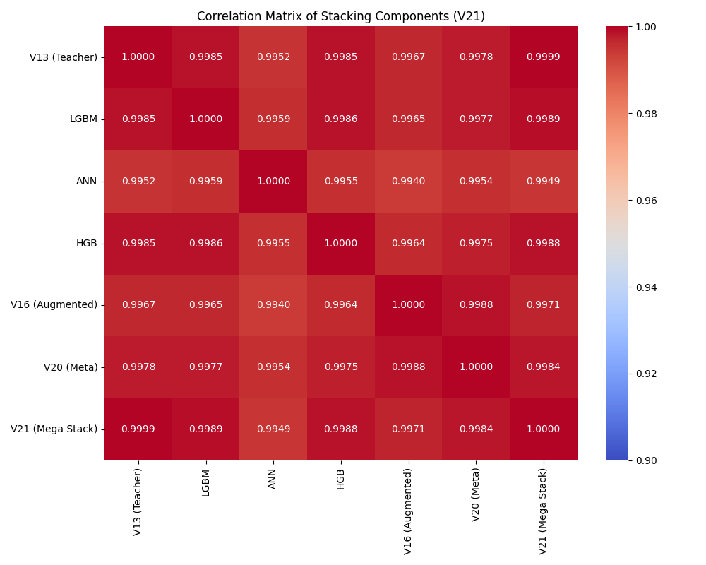

# Kaggle Playground Series S6E1: Student Exam Score Prediction

Repository for the Kaggle Playground Series S6E1 competition. The goal is to predict students' exam scores based on demographic and behavioral data using RMSE as the primary metric.

## Project Structure
- `data/`: Dataset files (train, test, sample submission).
- `scripts/`: Python scripts for EDA, preprocessing, and training.
- `submissions/`: Generated submission files.
- `images/`: Generated plots and visualizations.

## Benchmarks (Local CV RMSE)

| Version | Model | Description | CV RMSE |
|---------|-------|-------------|---------|
| V1 | XGBoost | Baseline + Ordinal Encoding | 8.7610 |
| V2 | XGBoost | + Interactions, Target Encoding, Clustering | 8.7550 |
| V7 | XGBoost | Conservative FE (Sleep Score, Facility Ratio) | 8.7579 |
| V7 Tuned | XGBoost | V7 + Massive Optuna Tuning | 8.7554 |
| V11 | XGBoost | **Original + Pseudo + V7 Features** | 8.7294 |
| V13 | Teacher | XGBoost Distilled from V12 (Orig + Pseudo) | 8.7306 |
| V14 | Blend | 70% V13 + 25% LGBM + 5% ANN | 8.7314 |
| V16 | XGBoost | Augmented Data (Noise injection at extremes) | 8.8362 |
| V20 | Meta-Teacher | XGBoost + Knowledge Distillation (V19) + Augmentation | 8.7847 |
| **V21** | **Mega Stack** | **Ridge Stacking (V13, LGBM, ANN, HGB, V16, V20)** | **8.7267** |

## Key Findings
1. **Original Data Utility**: Adding the original 20k dataset significantly improved performance (V10/V11).
2. **Pseudo-Labeling**: Using high-confidence predictions from previous best models as training data (Teacher-Student) pushed RMSE down by ~0.02.
3. **Extreme Value Difficulty**: Models struggle with scores < 60 and > 85.
   - **Solution**: We implemented "Augmented" models (V16, V20) that injected noise into training data specifically for these extreme rows to force the model to learn robust boundaries.
   - **Stacking**: While these augmented models had higher individual RMSE, they provided critical diversity for the Stacker (V21), which learned to leverage them.
4. **Diversity over Accuracy**: The ANN (CV 8.89) and Augmented XGB (CV 8.83) were essential for the final ensemble's success, proving that uncorrelated errors are more valuable than pure individual accuracy for stacking.

## Visualizations
### Stacking Correlation (V21)

*The low correlation of ANN and V16/V20 with the main models (V13/LGBM) highlights their contribution to the ensemble's diversity.*

## How to Run
1. Create virtual environment: `python -m venv .venv`
2. Activate and install deps: `.venv\Scripts\python.exe -m pip install -r requirements.txt`
3. **Generate V21 Submission**:
   ```bash
   # 1. Train Base Models & Save OOFs
   python scripts/train_v13_teacher.py
   python scripts/train_lgbm.py
   python scripts/train_ann.py
   python scripts/train_hgb.py
   python scripts/train_v16_aug.py
   
   # 2. Train Meta-Teacher (Optional, adds V20)
   python scripts/train_v19_stacking.py # needed for V20 pseudo
   python scripts/train_v20_meta_teacher.py
   
   # 3. Final Stack
   python scripts/train_v21_mega_stacking.py
   ```