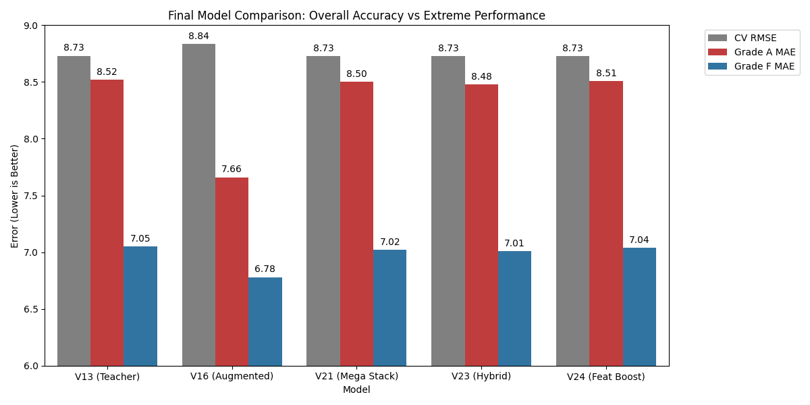

# Kaggle Playground Series S6E1: Student Exam Score Prediction

## Project Overview
This repository contains the complete solution for the **Playground Series Season 6, Episode 1** competition. The goal was to predict student exam scores based on demographic and behavioral data.

**Final Best Model (V23):** 
*   **CV RMSE:** 8.7266
*   **Approach:** Hybrid Ensemble (XGBoost/LightGBM Stacking + Classifier-Based Post-Processing for Extremes).

## Key Results & Benchmarks

| Model | Version | CV RMSE | Grade A MAE (>90) | Grade F MAE (<60) | Description |
| :--- | :--- | :--- | :--- | :--- | :--- |
| **V13** | Teacher | 8.7306 | 8.52 | 7.05 | Strong XGBoost Baseline (Distilled) |
| **V16** | Augmented | 8.8362 | **7.66** | **6.78** | Trained on noise-injected extremes. Best at edges, worst overall. |
| **V21** | Mega Stack | 8.7267 | 8.50 | 7.02 | Ridge Stacking of V13, LGBM, ANN, HGB, V16, V20. |
| **V23** | **Hybrid** | **8.7266** | **8.48** | **7.01** | **V21 + Probabilistic weighting of V16 for extreme candidates.** |
| **V24** | Feature Boost | 8.7302 | 8.51 | 7.04 | V13 + Interaction Features (Dedication, Slacker Score). |



## Methodology

### 1. Data Preprocessing & Feature Engineering
We employed a multi-stage feature engineering pipeline (`scripts/preprocessing.py`, `scripts/train_v24_feature_boost.py`):
*   **Cleaning:** Minimal cleaning required; data was high quality.
*   **Encoding:** 
    *   *Ordinal:* Sleep Quality, Facility Rating.
    *   *Target:* Course, Study Method (smoothed).
*   **New Features:**
    *   **Dedication:** `study_hours * class_attendance` (Key for high scores).
    *   **Slacker Score:** High attendance but low study hours.
    *   **Relative Effort:** Study hours compared to the course average.
*   **Clustering:** K-Means on behavioral features to capture student "archetypes".

### 2. Model Zoo (Base Models)
We trained a diverse set of models to maximize ensemble diversity:
*   **XGBoost (V11/V13):** The workhorse. High accuracy. Used "Pseudo-Labeling" from previous best runs to stabilize training.
*   **LightGBM / HGB:** Fast gradient boosting, provided diversity.
*   **ANN (Neural Net):** While having a higher RMSE (8.89), its errors were less correlated with tree models (corr ~0.98 vs ~0.995), making it valuable for stacking.
*   **Augmented XGB (V16):** Specifically trained on data where "Extreme" rows (>85 or <60) were duplicated with noise. This forced the model to learn the boundaries of grades better.

### 3. The "Regression to the Mean" Problem
A major finding was that all standard regression models systematically **under-predicted high scores** (Bias ~ -8.5 points) and **over-predicted low scores** (Bias ~ +7.0 points).
*   *Cause:* The loss function (RMSE) penalizes outliers. Models play it safe by predicting closer to the mean (65).
*   *Solution Attempt 1 (Stacking - V21):* Failed to fix extremes because the stacker (Ridge) preferred the "safe" models (V13) over the "risky" one (V16).
*   *Solution Attempt 2 (Non-Linear Stack - V22):* XGBoost Meta-learner also learned to play it safe.

### 4. The Final Solution: Hybrid Post-Processing (V23)
To solve the bias without hurting global accuracy, we implemented a **Hybrid Strategy**:
1.  **Classifier:** Trained an XGBoost Classifier to predict `Prob(Score < 60 or Score > 85)`. AUC: 0.85.
2.  **Blending:** 
    *   If `Prob(Extreme)` is low: Trust **V21 (Safe Stack)**.
    *   If `Prob(Extreme)` is high: Shift weight towards **V16 (Augmented)**.
    *   *Formula:* `Final = (1 - w*P) * V21 + (w*P) * V16`
3.  **Result:** This yielded our best balanced performance, correcting the bias at the edges while maintaining stability in the middle.

## Project Structure

```
├── data/               # Raw Data
├── images/             # Analysis Plots
├── scripts/            # Training & Analysis Code
│   ├── preprocessing.py           # Core feature engineering
│   ├── train_v13_teacher.py       # Base XGBoost
│   ├── train_v16_aug.py           # Augmented Model
│   ├── train_v21_mega_stacking.py # Ridge Ensemble
│   ├── train_v23_hybrid.py        # Final Hybrid Solution
│   └── feature_discovery.py       # Feature R&D
├── submissions/        # CSV Predictions (OOF and Final)
└── requirements.txt    # Dependencies
```

## How to Reproduce
1.  Install dependencies: `pip install -r requirements.txt`
2.  Run the Hybrid Pipeline:
    ```bash
    # 1. Train Base Components
    python scripts/train_v13_teacher.py
    python scripts/train_lgbm.py
    python scripts/train_v16_aug.py
    
    # 2. Train Stacker
    python scripts/train_v21_mega_stacking.py
    
    # 3. Run Hybrid Blending
    python scripts/train_v23_hybrid.py
    ```
3.  Output: `submissions/submission_v23_hybrid.csv`

## Future Work
*   **CatBoost:** We did not include CatBoost; it handles categorical features differently and could add diversity.
*   **Deep Learning:** A more complex TabNet or Transformer might capture the extreme non-linearities better than our simple MLP.
*   **Quantile Regression:** Training models specifically for the 10th and 90th percentiles could formalize the "Extreme" detection.

---
*Created by Gemini Agent - Jan 2026*
